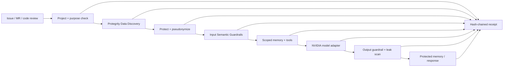

# LORE — Protected Organizational Memory for Engineering Teams

**The AI that remembers why your system was built this way—without exposing the source material that taught it.**

LORE follows software work from issue to production. It predicts failures from past incidents, checks merge requests against architectural decisions, verifies implementation promises, catches security regressions, preserves decisions from code and discussion, detects repeated review patterns, and creates evidence-backed onboarding and health briefings.

Protegrity is LORE's mandatory first data boundary. Raw identities, credentials, repository-specific identifiers, and unprotected sensitive values do not reach persistent memory, NVIDIA, agent output, or telemetry. The AI receives only protected, pseudonymized, purpose-scoped engineering context.

## Two-minute judge path

1. Run `.venv\Scripts\python.exe scripts\demo-preflight.py` to prove the live isolated Protegrity boundary, credential isolation, NVIDIA configuration, protection postcondition, Attack Lab, and receipt-chain integrity.
2. Open [http://localhost:3001/protection](http://localhost:3001/protection), run the synthetic record, and open its Protection Receipt.
3. Open [http://localhost:3001/ai-review](http://localhost:3001/ai-review) to run the full Protegrity → NVIDIA → output-scan implementation.
4. Open [http://localhost:3001/attack-lab](http://localhost:3001/attack-lab), run `LPA-01`, and inspect the Protegrity Semantic Guardrail block.
5. Open [http://localhost:3001](http://localhost:3001) to see the complete protected pipeline, model-destination evidence, and hash-chain status.

See the [Judge Quickstart](docs/judge-quickstart.md) for the exact evidence to inspect.

## Why Protegrity is central

Every sensitive operation must cross the isolated Privacy Gateway before LORE may persist data or call a model:

1. Authenticate the source and resolve project and purpose.
2. Discover sensitive entities with Protegrity Data Discovery.
3. Protect the complete canonical payload and create a pseudonymized, minimum-necessary AI-safe view.
4. Rescan the protected view and fail closed if a prohibited match remains.
5. Run Protegrity input Semantic Guardrails.
6. Retrieve only project-scoped protected memory and use traced tools.
7. Send the protected prompt through a provider-neutral NVIDIA adapter.
8. Run output `pii` guardrails, discovery, secret/canary checks, and release policy.
9. Write only protected memory or protected comments.
10. Append a hash-chained Protection Receipt containing decisions, hashes, sizes, counts, and timings—never payloads.

The API, dashboard, agents, tools, and NVIDIA adapter have no Protegrity credentials and no unprotect capability. If discovery, protection, guardrails, or postconditions fail, LORE blocks before persistence or inference. The deterministic engine exists only for explicitly configured unit tests.

## Working product

- **Pre-mortem and SpecForge:** searches organizational history, predicts likely failures, asks hard questions, and generates an engineering spec.
- **Five-layer MR review:** decision conflicts, promise verification, Security Sentinel, code intelligence, and learned pattern enforcement.
- **Living memory:** captures decisions from both review discussion and actual diffs, including rejected alternatives, rationale, dependencies, confidence, and security relevance.
- **Memory evolution:** intentional overrides supersede old decisions while preserving reasoning and transferring dependency links.
- **LORECAST:** decision health, sustainability estimates, dependency graph, security inventory, and coverage gaps.
- **Onboarding:** security-first briefing, architecture by file, incidents, conventions, key people, and recent changelog.
- **LORE Ask and Migrate:** natural-language memory search and cold-start import from historical merge requests.
- **Privacy Control Center:** real readiness, receipts, entity counts, guardrail outcomes, model-payload hashes/sizes, destination scans, blocked operations, and chain integrity.
- **Attack Lab:** eight runnable prompt injection, memory exfiltration, encoded leakage, tool abuse, malicious-MR, cross-project, and log-injection probes.

## Architecture



Runtime components:

- FastAPI webhook, agent, evidence, and demonstration APIs;
- isolated Python Privacy Gateway with pinned Protegrity SDK;
- official Protegrity Data Discovery and Semantic Guardrail containers;
- provider-neutral LLM gateway configured for NVIDIA;
- GitLab/GitHub project and protected-memory adapters;
- Next.js Privacy Control Center;
- Python CLI for memory validation, statistics, synchronization, and dashboard generation.

Detailed architecture: [docs/protegrity-architecture.md](docs/protegrity-architecture.md).

## Configure local secrets

LORE deliberately uses two environment files:

1. Copy `legacy/.env.template` to `legacy/.env`. Configure GitLab/GitHub, NVIDIA/OpenAI-compatible AI, the webhook secret, and `PROTEGRITY_PRIVACY_GATEWAY_URL`. Do **not** put Protegrity credentials here.
2. Copy `legacy/privacy_gateway/.env.template` to `legacy/privacy_gateway/.env`. Put `DEV_EDITION_EMAIL`, `DEV_EDITION_PASSWORD`, and `DEV_EDITION_API_KEY` only in this gateway-owned file.

Both `.env` files are ignored by Git.

## Start the complete stack

```text
docker compose -f docker-compose.protegrity.yml up -d --build

.venv\Scripts\python.exe -m uvicorn main:app --app-dir legacy --host 127.0.0.1 --port 8000

cd lore-dashboard
npm install
npm run build
npm run start -- -p 3001 -H 127.0.0.1
```

Then run:

```text
.venv\Scripts\python.exe scripts\demo-preflight.py
```

## Verification

```text
.venv\Scripts\python.exe -m pytest legacy\tests -q
.venv\Scripts\python.exe -m pytest lore-cli\tests -q

cd lore-dashboard
npm run lint
npm run build
```

Current verified result: 17 privacy/API/agent tests and 43 CLI tests pass; the TypeScript and production Next.js builds pass. The live preflight independently verifies the real Protegrity/NVIDIA runtime without printing secrets.

## Documentation

- [Protected AI architecture](docs/protegrity-architecture.md)
- [Judge quickstart](docs/judge-quickstart.md)
- [Threat model](docs/threat-model.md)
- [Security and product limitations](docs/limitations.md)
- [Developer Edition feedback](docs/developer-feedback.md)
- [Detailed agent and memory reference](AGENTS.md)

LORE uses synthetic data for development and demonstration. It makes no security-certification, privacy-compliance, sustainability-audit, or production-readiness claim.
