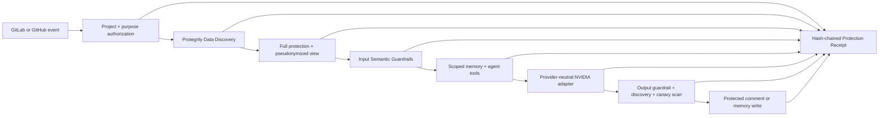

# LORE protected AI architecture

LORE is a living organizational memory for software teams. It observes issues, merge requests, code review, diffs, and decisions; predicts likely failures; checks implementation promises; catches security regressions; and preserves the reasoning behind architectural choices. Protegrity is the mandatory boundary controlling what organizational data may reach persistent memory, AI providers, tools, responses, and evidence logs.

## Trust boundaries

The webhook/API process is a trusted transient ingress boundary. It may receive raw issue, review, diff, or identity data in memory, but it has no Protegrity credential and no unprotect capability. It sends content to the isolated Privacy Gateway before persistence or model access.

The Privacy Gateway is the only component that receives Protegrity Developer Edition email, password, and API key. It runs Data Discovery, creates a full AES-256-GCM canonical envelope using a per-trace key wrapped by Protegrity, produces a separately pseudonymized AI-safe view, rescans the protected result, and calls Semantic Guardrails for both input and output policy. It disables SDK payload logging and returns only protected text and non-sensitive evidence metadata to the API.

The model adapter receives minimum-necessary protected prompts. Immediately before each NVIDIA request, LORE records the SHA-256 hash and byte count of the exact serialized request plus zero-match scan outcomes. It never logs the request body or credential. Provider-neutral interfaces keep the AI provider replaceable; NVIDIA is the configured demonstration provider.

## Controlled representations

| Representation | Contents | Destinations |
|---|---|---|
| Canonical protected envelope | Complete source text encrypted with AES-256-GCM; per-trace key wrapped by Protegrity | Privacy Gateway only in the current prototype |
| AI-safe view | Pseudonymized identities and repository-specific identifiers; secrets masked; necessary engineering facts retained | agent prompts, protected memory, scoped tool output, NVIDIA |
| Evidence metadata | trace IDs, entity categories/counts, policy results, hashes, byte counts, timings, and chain hashes | Privacy Control Center and JSONL evidence |

“No entity detected” is not treated as “safe.” The gateway protects the full canonical value, applies deterministic repository-secret patterns alongside Protegrity classification, and creates a separate minimized view. Post-protection discovery is a required postcondition; any remaining match blocks the workflow.

## Failure semantics

- Gateway, discovery, protection, key-wrap, Semantic Guardrail, or postcondition failure blocks the workflow before persistence or inference.
- The real runtime does not switch to the deterministic test engine. Tests must explicitly request local fallback.
- Invalid webhook authentication is rejected; an absent webhook secret does not permit access.
- Model/provider errors return a generic trace-bearing failure and do not log provider bodies.
- Output classified as malicious or containing exposed sensitive data is blocked or pseudonymized before GitLab/GitHub release.
- Evidence events are append-only and SHA-256 hash-chained. The dashboard verifies chain integrity on every overview request.

## Pipeline stages protected

1. **Ingestion:** source material remains transient until discovery and protection succeed.
2. **Memory:** reads are protected before agent use; writes and generated wiki/comments pass output policy again.
3. **Retrieval/tools:** tool calls carry a trace and project context; raw tool outputs do not enter telemetry.
4. **Inference:** complete protected prompts go through input Semantic Guardrails before NVIDIA.
5. **Response:** structured output passes PII guardrails, discovery, masking/pseudonymization, and release policy.
6. **Logs/evidence:** payload-free metadata is redacted, hash-chained, and inspectable by trace.
